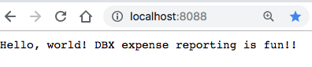
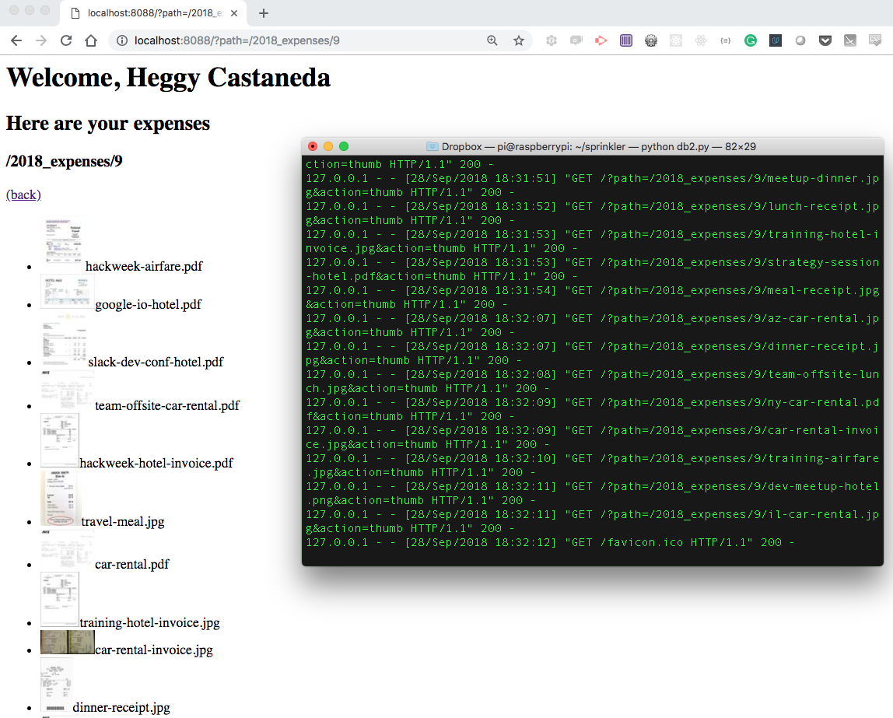

# Expense organizer app with DBX API

**Demo:**
- Dropbox (DBX) API to OAuth into DBX\

- DBX API to Render images\

**Objective:** Expense organizer app that runs on DBX. Dropbox APIs featuring content Endpoints.

    * OAuth: Direct the user to Dropbox, and prompt for a code.
    * Render image: Files/get_thumbnail Dropbox API call to return a jpeg image for a given path.

## What do I do to try out OAuth on DBX?
- OAuth DBX platform
====================
1. Check for Python installation in your terminal, if Python is missing or not found, you’ll need to **[install](https://www.python.org/downloads/)** it here.
------

> python -V

------
2. Install DropBox (DBX) Platform Python SDK.
------

> pip install dropbox

------

3. OAuth, direct the user to Dropbox, and prompt for a code.  DropboxOAuth2FlowNoRedirect object constructs a URL to https://www.dropbox.com/oauth2/authorize

------

> from dropbox import DropboxOAuth2FlowNoRedirect
>
> auth_flow = DropboxOAuth2FlowNoRedirect("APP_KEY", "APP_SECRET")
> print("Authorize your script here: "+auth_flow.start())
> code = raw_input('Input your code: ').strip()
> 
> print("Initializing Dropbox API...")
> dbx = dropbox.Dropbox(auth_flow.finish(code).access_token)

------

4. Run db1.py in your terminal

5. Go to the URL you are given to get the OAuth code to get access to the expense receipts

## What do I do to try out the get image thumbnail on DBX?
- Render Image Thumbnail on DBX platform
=========================================
1. Run db2.py.
------

> python db2.py

------
2. Go to http://localhost:8088

## References: 
- [Note](https://goo.gl/Uovijx)
- [DBX Event](https://dbxdevworkshopsf.splashthat.com/)
